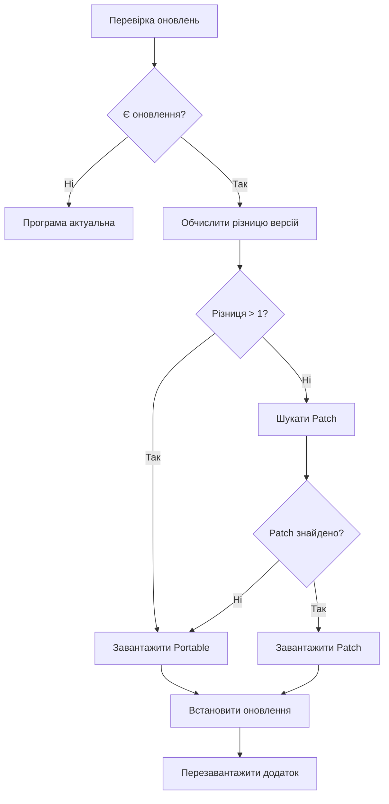

# Update Logic - Smart Version Detection

## 📋 Опис

Покращена логіка оновлень, яка автоматично визначає оптимальний спосіб оновлення на основі різниці версій.

## 🎯 Логіка роботи

### 1️⃣ Різниця = 1 версія (наприклад, 1.5.6 → 1.5.7)
- ✅ Шукає **прямий patch** для швидкого оновлення
- 📦 Розмір: ~7-10 MB
- ⚡ Швидке завантаження та встановлення

### 2️⃣ Різниця > 1 версії (наприклад, 1.5.5 → 1.5.7)
- ⚠️ Пропущено проміжні версії
- 📦 Одразу завантажує **portable версію**
- 💾 Розмір: ~150 MB
- ✅ Гарантує повне та коректне оновлення

### 3️⃣ Різниця в major/minor (наприклад, 1.4.x → 1.5.x)
- 🔄 Автоматично визначається як велика різниця
- 📦 Завантажує **portable версію**
- 🔒 Запобігає проблемам сумісності

## 🔧 Технічна реалізація

### Новий метод: `getVersionDifference()`

```typescript
private getVersionDifference(fromVersion: string, toVersion: string): number {
  // Парсинг версій (1.5.6 → [1, 5, 6])
  const fromParts = cleanFrom.split('.').map(p => parseInt(p, 10) || 0)
  const toParts = cleanTo.split('.').map(p => parseInt(p, 10) || 0)

  // Якщо major або minor відрізняються → велика різниця
  if (fromParts[0] !== toParts[0] || fromParts[1] !== toParts[1]) {
    return 999
  }

  // Різниця в patch версії
  return Math.abs(toParts[2] - fromParts[2])
}
```

### Оновлена логіка завантаження

```typescript
// Перевірка різниці
const versionDiff = this.getVersionDifference(currentVersion, latestVersion)

if (versionDiff > 1) {
  // Завантажити portable
  const portableAsset = findPortableAsset()
  await downloadAndInstall(portableAsset)
} else {
  // Спробувати знайти patch
  const patchAsset = findPatchAsset()
  await downloadAndInstall(patchAsset)
}
```

## 📊 Приклади

### Сценарій 1: Послідовне оновлення
```
Поточна: 1.5.6
Доступна: 1.5.7
Різниця: 1
Рішення: ✅ Patch (7 MB)
```

### Сценарій 2: Пропущена версія
```
Поточна: 1.5.5
Доступна: 1.5.7
Різниця: 2
Рішення: 📦 Portable (150 MB)
Причина: Пропущено v1.5.6
```

### Сценарій 3: Велике оновлення
```
Поточна: 1.4.9
Доступна: 1.5.7
Різниця: major/minor
Рішення: 📦 Portable (150 MB)
Причина: Зміна minor версії
```

## 🎨 UI Повідомлення

Користувач бачить зрозумілі повідомлення:

### При різниці > 1:
```
⚠️ Пропущено більше 1 версії (2). Рекомендується portable версія
📦 Шукаю portable файл для оновлення...
✅ Знайдено portable файл: KontrNahryuk-v1.5.7-portable.zip
💾 Розмір: 147.54 MB
```

### При різниці = 1:
```
📊 Різниця версій: 1 (1.5.6 → 1.5.7)
📥 Завантаження patch файлу: KontrNahryuk-v1.5.6-to-v1.5.7-patch.zip
💾 Розмір: 7.42 MB
```

## ✅ Переваги

1. **Економія трафіку**: Patch файли для послідовних оновлень
2. **Надійність**: Portable для великих стрибків версій
3. **Автоматизм**: Користувач не вибирає, система сама визначає
4. **Прозорість**: Зрозумілі логи про прийняті рішення

## 🔄 Workflow



## 📝 Changelog

**Version:** Added in 1.5.7

**Changes:**
- Додано `getVersionDifference()` метод
- Оновлено `downloadUpdate()` з логікою перевірки різниці
- Portable версія завантажується автоматично при різниці > 1
- Покращені логи та повідомлення користувачу

## 🐞 Відомі обмеження

- Працює тільки для semantic versioning (major.minor.patch)
- Ланцюжок патчів (через проміжні версії) залишається для майбутніх версій
- Portable завантаження може бути повільним на слабкому інтернеті

## 🔮 Майбутні покращення

- [ ] UI діалог вибору (patch vs portable)
- [ ] Кешування portable файлів
- [ ] Порівняння розміру файлів перед завантаженням
- [ ] Відновлення перерваних завантажень
